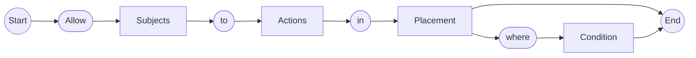

# IAM
# Policy
- https://docs.oracle.com/ja-jp/iaas/Content/Identity/policieshow/Policy_Basics.htm



```
ALLOW GROUP 'default'/'Administrator' to manage all-resources IN TENNCY
ALLOW GROUP 'Procution'/'NetworkAdmin' to manage virtual-network-family IN compartment Sandbox
```
## Actions句


- https://docs.oracle.com/ja-jp/iaas/Content/Identity/policieshow/Verbs.htm

動詞|アクセスのタイプ|権限の例
--|--|--
inspect|監査、列挙、監視|inspect objects
read|変更しない|read objects
use|変更する|use objects
manage|何かをする権限|manage objects
