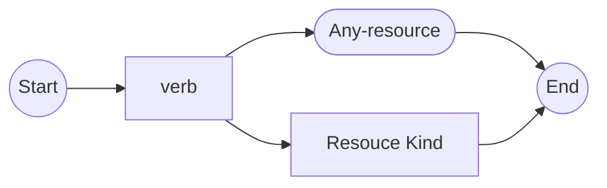
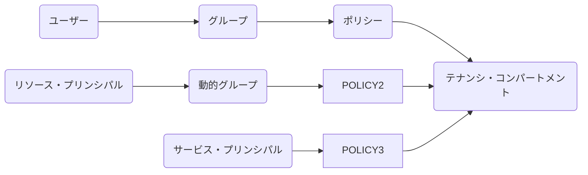

# IAM
# アイデンティティ・ドメイン・タイプ
- https://docs.oracle.com/ja-jp/iaas/Content/Identity/sku/overview.htm
# Policy
- https://docs.oracle.com/ja-jp/iaas/Content/Identity/policieshow/Policy_Basics.htm


```
ALLOW GROUP 'default'/'Administrator' to manage all-resources IN TENNCY
ALLOW GROUP 'Procution'/'NetworkAdmin' to manage virtual-network-family IN compartment Sandbox
```
## Actions句


- https://docs.oracle.com/ja-jp/iaas/Content/Identity/policieshow/Verbs.htm

動詞|アクセスのタイプ|権限の例
--|--|--
inspect|監査、列挙、監視|inspect objects
read|変更しない|read objects
use|変更する|use objects
manage|何かをする権限|manage objects
## 条件付きポリシー
- https://docs.oracle.com/ja-jp/iaas/Content/Identity/policysyntax/conditions.htm

- PHX-AdminsはPHXリージョンのすべてのリソースが管理できる
```
Allow group 'DomainA'/'PHX-Admins' to manage all-resources in tenancy where request.region = 'PHX'
```

- NetworkAdminsグループは、oocid1.compartment.oc1..aaaaa以外の任意のコンパートメント内のVCNを管理できる
```
Allow group 'DomainA'/'NetworkAdmins' to manage virtual-network-family in tenancy where target.compartment.id != 'ocid1.compartmetn.oc1..aaaaa'
```

- Autodomous Databaseに関して、OLTPワークロード・タイプのデータベースおよびバックアップのみを許可
```
Allow group 'DomainA'/'ADB-Admins' to manage autonomous-database in tenancy where target.workloadType = 'OLTP'
```
## 最小権限の強制: 拡張ポリシー
- XYZグループに対して、ブロック・ボリュームを一覧/作成/書き込み/更新/移動はできますが、削除はできない
```
Allow group 'DomainA'/XYZ' to manage volumes in tenancy where any {
request.permission='VOLUME_INSPECT',
request.permission='VOLUME_CREATE',
request.permission='VOLUME_WRITE',
request.permission='VOLUME_UPDATE',
request.permission='VOLUME_MOVE'}
```

- != を使った表現
```
Allow group 'DomainA'/'XYZ' to manage volumes in tenancy where request.permissions!= 'VOLUME_DELETE'
```

- 特定のAPI操作に基づき条件指定(where requese.operation =)
```
Allog group 'DomainA'/'XYZ to manage volumes in tenancy whree any {
request.operation='ListVolumes',
request.operation='GetVolume',
request.operation='AttachVolume',
request.operation='CreateVolume',
request.operation='ChangeVolumeCompartment',}
```

- グループObjectWritersは、ABC内の任意のバケット内のオブジェクトを検査(inspect)およびアップロード(create)できる
```
Allow group 'DomainA'/'ObjectWriters' to manage objects in compartment 'ABC' where any {
request.permissions='OBJECT_CREATE',
request.permissions='OBJECT_INSPECT'}
```

- ABC内のBucketAを検査(inspect)およびアップロード(create)できる
```
Allow group 'DomainA'/'ObjectWriters' to manage objects in compartment 'ABC' where any {
all {terget.bucket.name='BucketA',
any {request.permissions='OBJECT_CREATE',
request.permissions='OBJECT_INSPECT'}
}
```

- Contractoresグループは、特定の期間中にのみインスタンスを使用できます
```
Allow group 'DomainA'/'Contractors to use instances in compartment 'contractors' where
all {request.utctimestamp after '<TIME>',
request.utctimestamp before '<TIME>'}
```
### タグ・ベースのアクセス制御 (TBAC)
#### リクエスト元のリソース (グループ、動的グループ、コンパートメント)
- グループ (Operations.Project='Prod'でタグのグループに所属するすべてのユーザーはHRのインスタンスを管理できます)
```
Allow any-user to manage instances in compartment 'HR' where request.principal.group.tag.Operations.Project='Prod'
```
- 動的グループ (Operations.Project='Prod'タグの動的グループInstanceA内のインスタンスは、HRオブジェクトを管理できる
```
Allow dynamic-group 'DomainA'/'InstanceA' to manage object-family in compartment 'HR' where request.principal.group.tag.Operations.Project='Prod'
```
- コンパートメント (動的グループInstancesA内のインスタンス(Operations.Project='Prod'タグのコンパートメントに存在)は、HRのオブジェクトを管理できる)
```
Allow dynamic-group 'DomainA/InstancesA' to manage object-family in compartment 'HR' where request.principal.compartment.tag.Operations.Project='Prod'
```
- グループ (Adminタグを持つ管理グループはTestにアクセスできる)
```
Allow any-user to manage all-resources in compartment Test where request.principal.group.tag.EmployeeGroup.Role='Admin'
```
#### リクエストのターゲット (リソースまたはコンパートメント)
- リソース (GroupAはOperations.Project='Prod'のリソースを管理できる)
```
Allow group 'DomainA'/'GroupA' to manage all-resources in compartment HR where target.resource.tag.Operations.Project='Prod'
```
- コンパートメント (GroupAのメンバはOperations.Project='Prod'のコンパートメントにあるリソースを管理できる)
```
Allow group 'DomainA'/'GroupA' to manage all-resources in tenancy where target.resource.compartment.tag.Operations.Project='Prod'
```
- コンパートメント (グループTestersが、Testタグのコンパートメントにアクセスできる)
```
Allow group 'DomainA'/'Teters' to use all-resources in tenancy where target.resource.compartment.tag.ResourceGroup.Role='Test'
```
## ネットワーク・ソース
- https://docs.oracle.com/ja-jp/iaas/Content/Identity/networksources/Restricting_Access_to_Specific_IP_Addresses.htm

```
Allow group 'DomainA'/AdminGrp-A' to manage object-family in tenancy where request.networkSource.name='corpnet'
```
# 割り当て制限ポリシーの構文
- https://docs.oracle.com/ja-jp/iaas/Content/Quotas/Concepts/quota_policy_syntax.htm

```
set vcn quota vcn-count to 4 in compartment Production
set database quota /*exadata*/ to 1 in tenancy
set compute-core quota standard2-core-count to 10 in tenancy
```

- 本番(Production)コンパートメントのみが、デフォルトの割り当て数にリセット
```
zero database quota /*exadata*/ in tenancy
unset database quota /*exadata*/ in compartment Production
```
# 動的グループ

