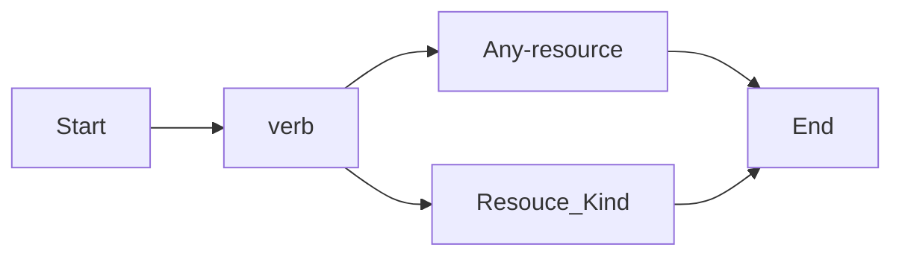

# IAM
# Policy
```
Allow group 'Procution'/'NetworkAdmin' to manage virtual-network-family in compartment Sandbox
```
## Actions句


動詞|アクセスのタイプ|権限の例
--|--|--
inspect|監査、列挙、監視|inspect objects
read|変更しない|read objects
use|変更する|use objects
manage|何かをする権限|manage objects
