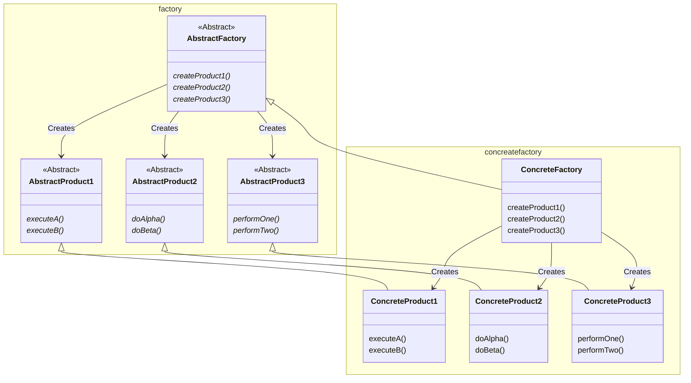

# Factory Method

```mermaid
classDiagram
    AbstractProduct1 <|-- ConcreteProduct1
    AbstractProduct2 <|-- ConcreteProduct2
    AbstractProduct3 <|-- ConcreteProduct3
    AbstractFactory  <|-- ConcreteFactory
    AbstractFactory  -->  AbstractProduct1 : Creates
    AbstractFactory  -->  AbstractProduct2 : Creates
    AbstractFactory  -->  AbstractProduct3 : Creates
    ConcreteFactory  -->  ConcreteProduct1 : Creates
    ConcreteFactory  -->  ConcreteProduct2 : Creates
    ConcreteFactory  -->  ConcreteProduct3 : Creates
    namespace factory {
        class AbstractProduct1{
            <<Abstract>>
            executeA()* 
            executeB()*
        }
        class AbstractProduct2{
            <<Abstract>>
            doAlpha()* 
            doBeta()*
        }
        class AbstractProduct3{
            <<Abstract>>
            performOne()* 
            performTwo()*
        }
        class AbstractFactory{
            <<Abstract>>
            createProduct1()*
            createProduct2()*
            createProduct3()*
        }
    }
    namespace concreatefactory {
        class ConcreteProduct1{
            executeA() 
            executeB()
        }
        class ConcreteProduct2{
            doAlpha() 
            doBeta()
        }
        class ConcreteProduct3{
            performOne() 
            performTwo()
        }
        class ConcreteFactory{
            createProduct1()
            createProduct2()
            createProduct3()
        }
    }
```
