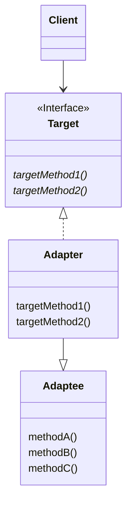
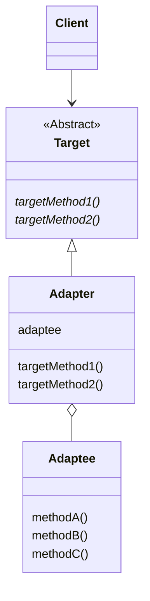

# Adapter (class)

```mermaid
classDiagram
    Client --> Target
    Target <|.. Adapter
    Adapter --|> Adaptee
    class Target{
        <<Interface>>
        targetMethod1()*
        targetMethod2()*
    }
    class Adapter{
        targetMethod1()
        targetMethod2()
    }
    class Adaptee{
        methodA()
        methodB()
        methodC()
    }
```
# Adapter (object)

```mermaid
classDiagram
    Client --> Target
    Target <|-- Adapter
    Adapter o-- Adaptee
    class Target{
        <<Abstract>>
        targetMethod1()*
        targetMethod2()*
    }
    class Adapter{
        adaptee
        targetMethod1()
        targetMethod2()
    }
    class Adaptee{
        methodA()
        methodB()
        methodC()
    }
```
