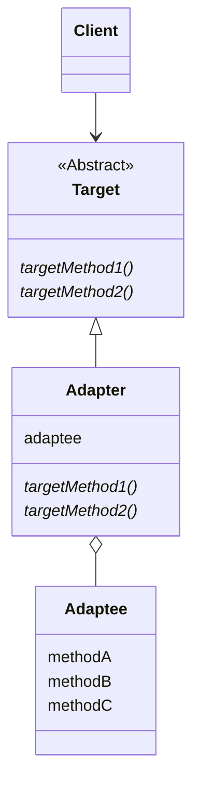

# Adapter (class)
# Adapter (object)

```mermaid
classDiagram
    Client --> Target
    Target <|-- Adapter
    Adapter o-- Adaptee
    class Target{
        <<Abstract>>
        targetMethod1()*
        targetMethod2()*
    }
    class Adapter{
        adaptee
        targetMethod1()*
        targetMethod2()*
    }
    class Adaptee{
        methodA
        methodB
        methodC
    }
```
