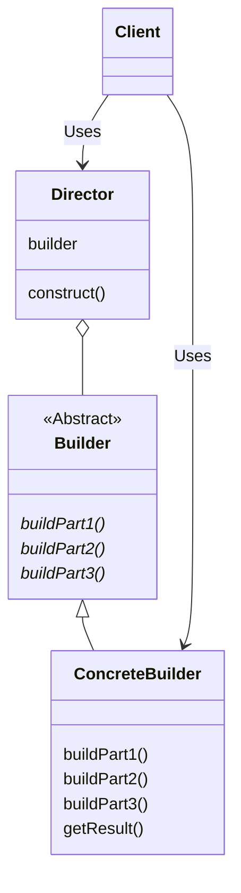

# Builder

```mermaid
classDiagram
    Builder <|-- ConcreteBuilder
    Director o-- Builder
    Client --> Director : Uses
    Client --> ConcreteBuilder : Uses
    class Builder{
        <<Abstract>>
        buildPart1()*
        buildPart2()*
        buildPart3()*
    }
    class ConcreteBuilder{
        buildPart1()
        buildPart2()
        buildPart3()
        getResult()
    }
    class Director{
        builder
        construct()
    }
    class Client{
    }
```
