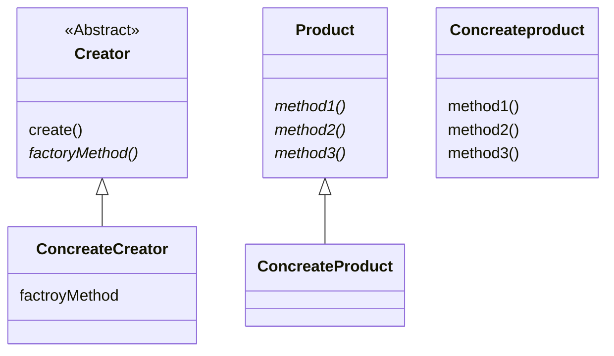

# Factory Method

```mermaid
classDiagram
    Creator <|-- ConcreateCreator
    Product <|-- ConcreateProduct
    class Creator{
        <<Abstract>>
        create() 
        factoryMethod()*
    }
    class ConcreateCreator{
        factroyMethod
    }
    class Product{
        method1()*
        method2()*
        method3()*
    }
    class Concreateproduct{
        method1()
        method2()
        method3()
    }
```
