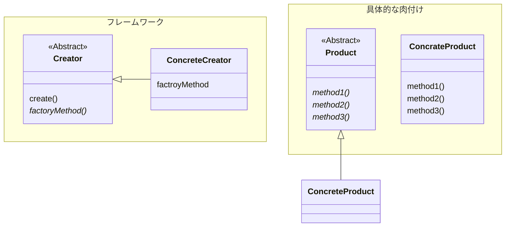

# Factory Method

```mermaid
classDiagram
    Creator <|-- ConcreteCreator
    Product <|-- ConcreteProduct
    namespace フレームワーク {
        class Creator{
            <<Abstract>>
            create() 
            factoryMethod()*
        }
        class ConcreteCreator{
            factroyMethod
        }
    }
    namespace 具体的な肉付け {
        class Product{
            <<Abstract>>
            method1()*
            method2()*
            method3()*
        }
        class ConcrateProduct{
            method1()
            method2()
            method3()
        }
    }
```
