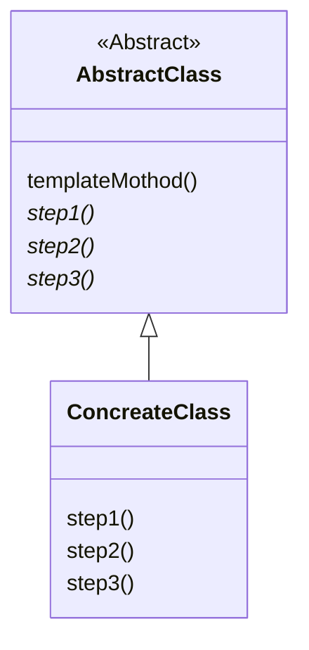

# Template Method

```mermaid
classDiagram
    AbstractClass <|-- ConcreateClass
    class AbstractClass{
        <<Abstract>> 
        templateMothod()
        step1()*
        step2()*
        step3()*
    }
    class ConcreateClass{
        step1()
        step2()
        step3()
    }
```
