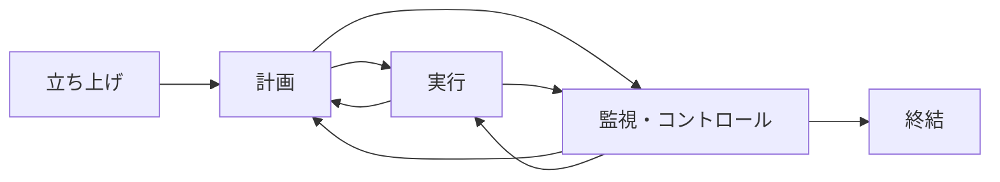

# 49のプロセス
- https://www.uclaextension.edu/sites/default/files/pdf/UCLA-Extension-Project-Management-49processes.pdf

|知識エリア|立ち上げ|計画|実行|監視・コントロール|終結
|---|---|---|---|---|---|
|統合|○|○ |○○|○○|○|
|スコープ|  |○○○○|   |○○|   |
|スケジュール|  |○○○○○|   |○|   |
|コスト|  |○○○|   |○|   |
|品質|  |○|○|○|   |
|資源|  |○○|○○○|○|   |
|コミュニケーション|  |○○○○○|○|○|   |
|リスク|  |○○○○○|○|○|  |
|調達|  |○|○|○|   |
|ステークホルダー|○|○|○|○|   |
# ITTO (Input - Tools & Techniques - Output)
- インプット - ツールと技法 - アウトプット
# 5つのプロセスグループ

# 10の知識エリア
# プロセスフロー
## (1) 立ち上げ
```mermaid
  flowchart LR
  A[<統合>\nプロジェクト検証の作成] --> B[<ステークホルダー>\nステークホルダーの特定]
  B --> A
