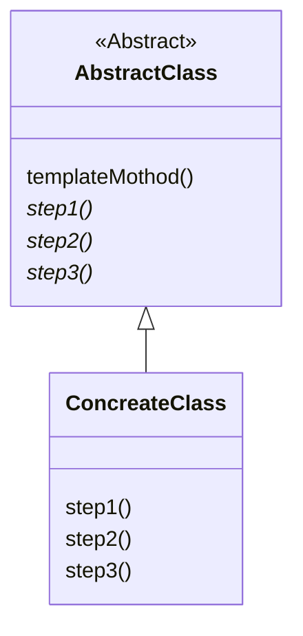

# Markdown
- https://docs.github.com/ja/get-started/writing-on-github/getting-started-with-writing-and-formatting-on-github/basic-writing-and-formatting-syntax
- https://github.github.com/gfm/
- [Mermaid記法に入門しよう #mermaid - Qiita](https://qiita.com/moikei/items/24e9e5bd8319a10f0115)
- https://docs.github.com/ja/get-started/writing-on-github/working-with-advanced-formatting/creating-diagrams
- https://github.com/mermaid-js/mermaid
- https://mermaid.js.org/syntax/classDiagram.html

## mermaid

