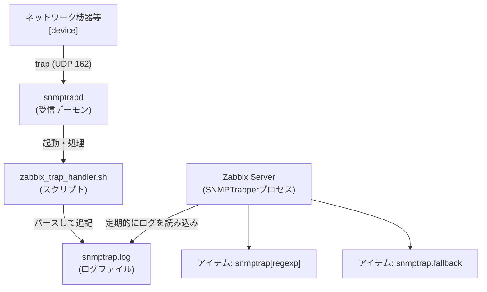

# SNMP Trap

- https://www.zabbix.com/documentation/current/jp/manual/config/items/itemtypes/snmptrap



## トラップ受信のワークフロー

1. snmptrapd がトラップを受信
2. snmptrapd がトラップを受信スクリプト（Bash、Perl）または SNMPTT に渡す
3. 受信側がトラップを解析、整形し、ファイルに書き込む
4. Zabbix SNMP トラッパーがトラップファイルを読み取り、解析する
5. 各トラップについて、Zabbix は受信したトラップのアドレスに一致するホストインターフェースを持つすべての SNMP トラッパーアイテムを検索する。 (一致判定では、ホストインターフェースで選択された IP または DNS のみが使用されることに注意)
6. 見つかった各アイテムについて、トラップは snmptrap[regexp] の正規表現と比較される。 トラップは一致したすべてのアイテムの値として設定される。 一致するアイテムが見つからず、snmptrap.fallback アイテムがある場合は、そのアイテムの値としてトラップが設定される。
7. トラップがいずれのアイテムの値としても設定されなかった場合、Zabbix は既定で一致しなかったトラップをログに記録する。 （「管理 > 一般設定 > その他 > マッチしないSNMPトラップをログに記録」で設定）

## SNMP トラップ形式

```
[timestamp] [the trap, part 1] ZBXTRAP [address] [the trap, part 2]
```

## 設定: snmptrapd と Bash の受信スクリプトを使用して、トラップを Zabbix サーバーに渡す例

```zsh
## zabbix_server.conf の設定

sudo vi /etc/zabbix/zabbix_server.conf

 (snip)
SNMPTrapperFile=/var/log/snmptrap/snmptrap.log
 (snip)
StartSNMPTrapper=1
 (snip)
__EOF__
```

```zsh
## /usr/sbin/zabbix_trap_handler.sh の設定

sudo curl -o /usr/sbin/zabbix_trap_handler.sh https://raw.githubusercontent.com/zabbix/zabbix-docker/7.4/templates/scripts/snmptraps/zabbix_trap_handler.sh

sudo chmod 755 /usr/sbin/zabbix_trap_handler.sh 

sudo vi /usr/sbin/zabbix_trap_handler.sh 

 (snip)
ZABBIX_TRAPS_FILE="/var/log/snmptrap/snmptrap.log"
 (snip)
__EOF__

sudo mkdir -pm 755 /var/log/snmptrap
sudo chown Debian-snmp:Debian-snmp /var/log/snmptrap
```

```zsh
## snmptrapd.conf の設定

sudo apt install snmp snmptrapd snmp-mibs-downloader

sudo cp -p /etc/snmp/snmptrapd.conf{,.orig}

sudo vi /etc/snmp/snmptrapd.conf
 (snip)
authCommunity log,execute,net Himitsu
traphandle default /bin/bash /usr/sbin/zabbix_trap_handler.sh
__EOF__

## snmp.conf の設定 (mibs の行をコメントアウト)

sudo cp -p /etc/snmp/snmp.conf{,.orig}

sudo vi /etc/snmp/snmp.conf

 (snip)
##mibs :
 (snip)
__END__
```

```zsh
## サービスを再起動

sudo systemctl restart zabbix-server snmptrapd
```

## アイテムの作成

- https://www.zabbix.com/documentation/current/jp/manual/config/items/item
- https://www.zabbix.com/documentation/current/jp/manual/config/items/itemtypes/snmptrap

### 設定例1 (ローカル試験用)

- 名前: SNMP trap test
- タイプ: SNMP トラップ
- キー: snmptrap["linkUp"]
- データ型: ログ
- ホストインターフェース: SNMP 127.0.0.1:161
- ログの時間の形式: yyyy-MM-ddThh:mm:ss

#### テスト

```zsh
snmptrap -v 2c -c Himitsu localhost '' linkUp.0
```

### 設定例2 (Cisco)

- 名前: linkDown
- タイプ: SNMP トラップ
- キー: snmptrap["linkDown"]
- データ型: ログ
- ホストインターフェース: SNMP 192.168.1.63:161
- ログの時間の形式: yyyy-MM-ddThh:mm:ss

名前: CISCO-CONFIG-MAN-MIB
タイプ: SNMP トラップ
キー: snmptrap["SNMPv2-SMI::enterprises.9.9.43.2.0.1"]
データ型: ログ
ホストインターフェース: SNMP 192.168.1.63:161
ログの時間の形式: yyyy-MM-ddThh:mm:ss

#### Cisco の設定

```
snmp-server community Himitsu RO
snmp-server trap-source GigabitEthernet1
snmp-server enable traps snmp linkdown linkup coldstart warmstart
snmp-server enable traps config
snmp-server host 192.168.1.35 vrf Mgmt-intf version 2c Himitsu
```

