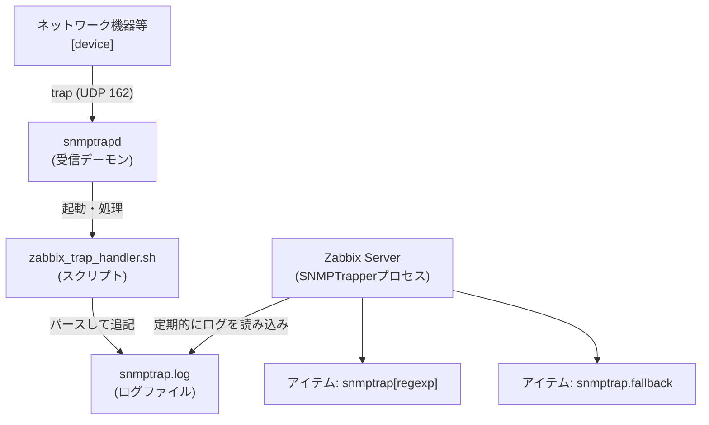

# SNMP Trap

- https://www.zabbix.com/documentation/current/jp/manual/config/items/itemtypes/snmptrap



## SNMP トラップ形式

```
[timestamp] [the trap, part 1] ZBXTRAP [address] [the trap, part 2]
```

